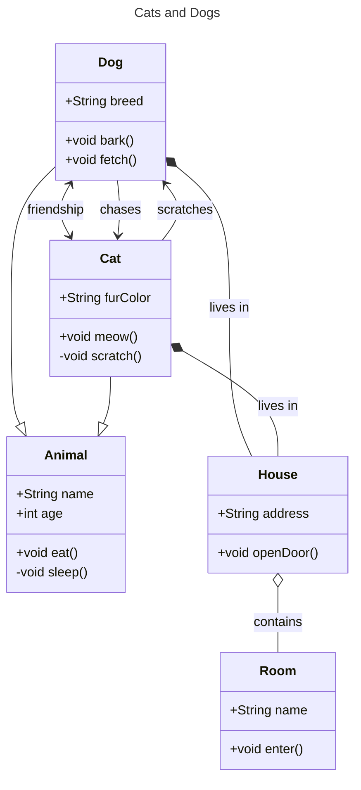
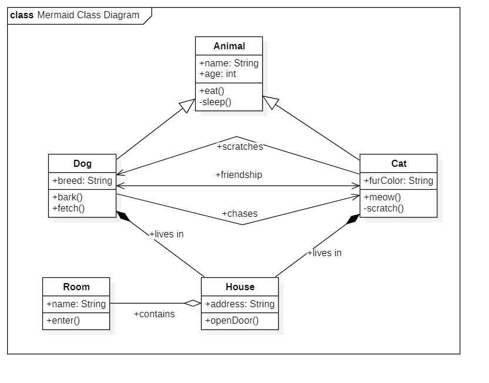
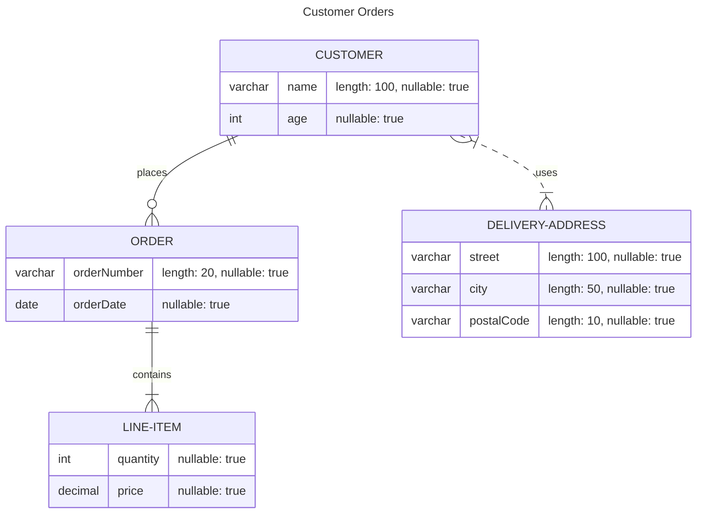
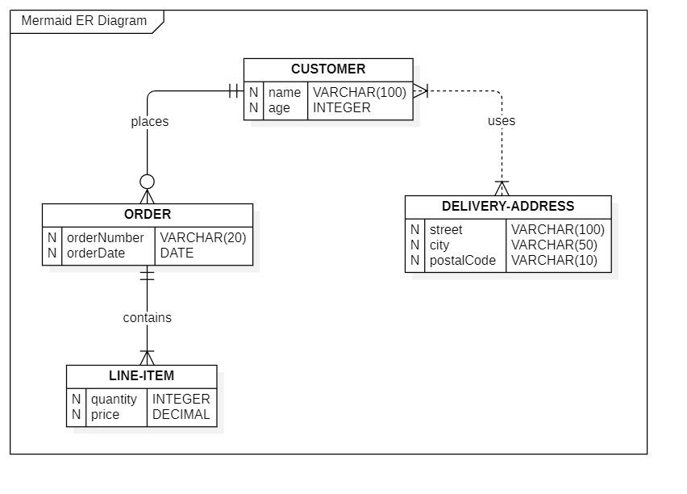
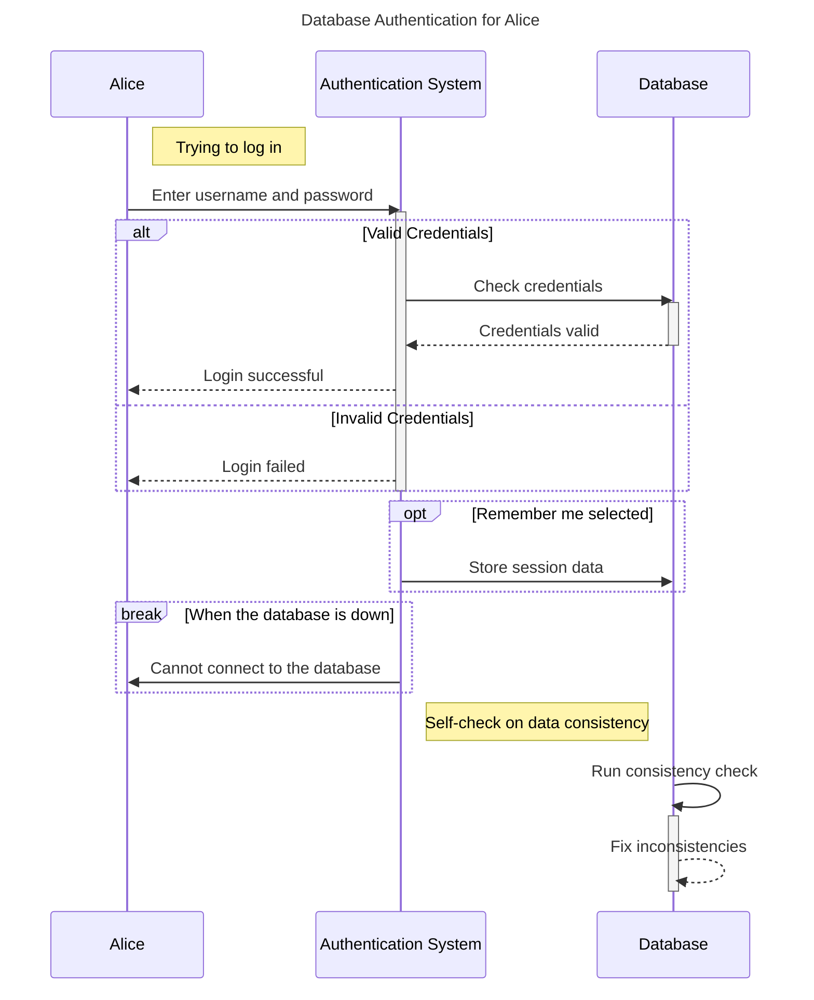

# Mermaid Bridge Extension for StarUML

## Overview

This StarUML extension provides a two-way bridge for converting diagrams between Mermaid syntax and StarUML. It supports importing Mermaid class diagrams into StarUML and exporting StarUML class diagrams into Mermaid format. It can handle various relationships such as inheritance, associations, aggregations, compositions, and directed associations.

### Features

- **Import from Mermaid**: Convert a Mermaid class diagram into a StarUML model.
- **Export to Mermaid**: Convert a StarUML class diagram into Mermaid syntax.
- **Supported Mermaid Relationships**:
  - class-diagrams: `classDiagram`
    - Bidirectional Association: `<-->`
    - Undirected Association: `--`
    - Inheritance: `--|>` & `<|--`
    - Aggregation: `o--` & `--o`
    - Composition: `*--` & `--*`
    - Directed Association: `-->` & `<--`
  - entity-relationship-diagrams: `erDiagram`
    - IsStrong Relationship: `--`
    - IsWeak Relationship: `..`
    - Zero-Or-One Relationship: `|o` & `o|`
    - Exactly-One Relationship: `||` & `||`
    - Zero-Or-Many Relationship: `}o` & `o{`
    - One-Or-Many Relationship: `}|` & `|{`

## Installation

1. Download the extension files or clone this repository.
2. Move the folder to your StarUML extensions directory:
   - Windows: `%appdata%\StarUML\extensions\user`
   - macOS: `~/Library/Application Support/StarUML/extensions/user/`
   - Linux: `~/.config/StarUML/extensions/user/`
3. Restart StarUML.
4. The extension should appear under the `Tools` menu as "Mermaid Bridge".

## Usage

### Importing from Mermaid

1. Go to `Tools > Mermaid Bridge > Import from Mermaid`.
2. Paste or upload your Mermaid class diagram code.
3. The diagram will be converted into a StarUML class diagram and added to your project.

### Exporting to Mermaid

1. Go to `Tools > Mermaid Bridge > Export to Mermaid`.
2. The currently active class diagram in StarUML will be converted to Mermaid syntax.
3. The resulting Mermaid code will be displayed, ready to be copied or saved.

## StarUML Overview

StarUML is a software modeling tool that supports UML, ERD, and other diagrams. You can download StarUML from [staruml.io](https://staruml.io/) for Windows, macOS, and Linux.

To install extensions:

- Open StarUML.
- Go to Tools > Extension Manager.
- Search for "Mermaid Bridge" or install directly from the downloaded files.

## Example Mermaid Syntax

> You can try and edit the `mermaid-code` I added below, here (just copy&paste): [Mermaid Live Editor](https://mermaid-js.github.io/mermaid-live-editor/). You can also find more examples in the [Mermaid documentation](https://mermaid.js.org/intro/).

**The following is an example of a CLASS diagram in Mermaid syntax:**

> Mermaid Class Diagram... after moving stuff around

**The following is an example of a ER diagram in Mermaid syntax:**

> Mermaid ER Diagram... after moving stuff around

**The following is an example of a Sequence diagram in Mermaid syntax:**

## Contributing

Contributions are welcome! Please submit a pull request or open an issue if you have any suggestions or improvements.

## License

This project is licensed under the MIT License.
