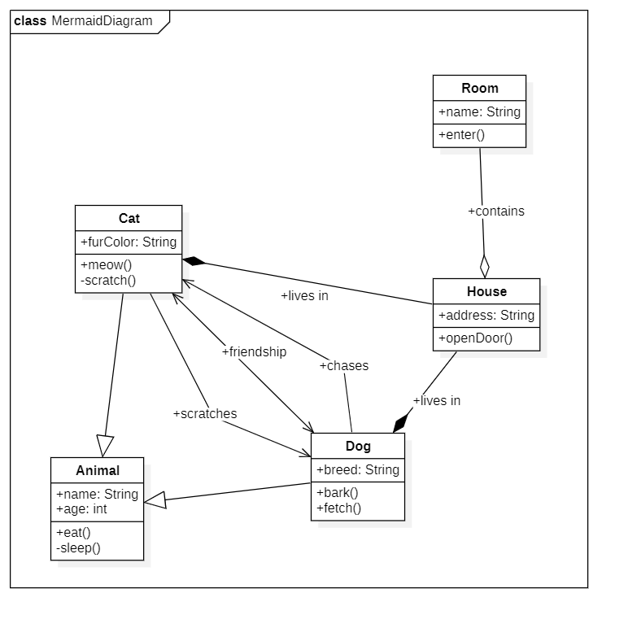
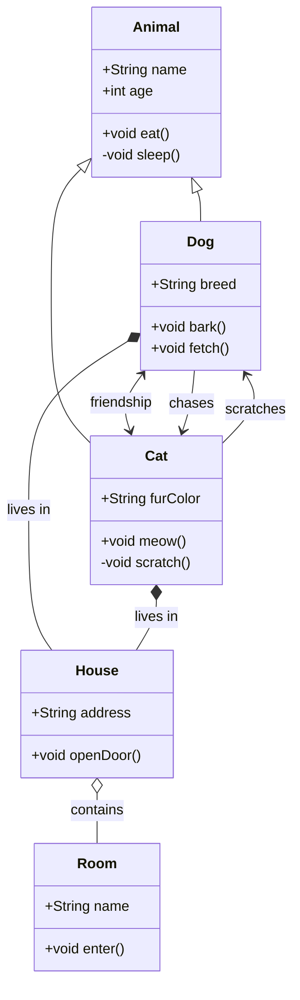
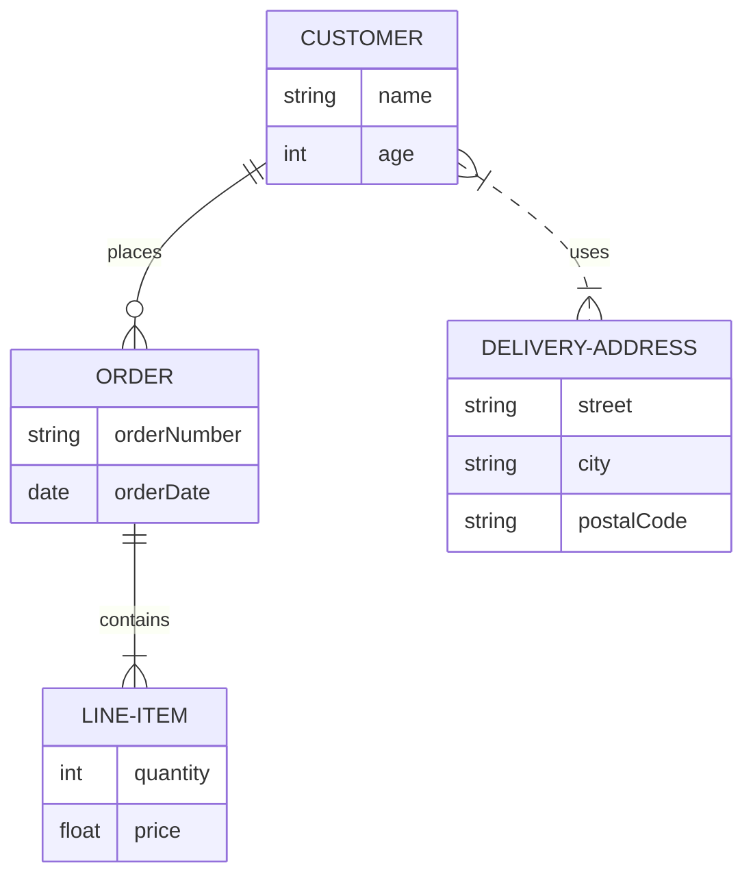

# Mermaid Bridge Extension for StarUML

## Overview

This StarUML extension provides a two-way bridge for converting diagrams between Mermaid syntax and StarUML. It supports importing Mermaid class diagrams into StarUML and exporting StarUML class diagrams into Mermaid format. It can handle various relationships such as inheritance, associations, aggregations, compositions, and directed associations.

### Features

- **Import from Mermaid**: Convert a Mermaid class diagram into a StarUML model.
- **Export to Mermaid**: Convert a StarUML class diagram into Mermaid syntax.
- **Supported Mermaid Relationships**:
  - Inheritance: `<|--`
  - Aggregation: `o--`
  - Composition: `*--`
  - Directed Association: `-->`
  - Bidirectional Association: `<-->`
  - Undirected Association: `--`

## Installation

1. Download the extension files or clone this repository.
2. Move the folder to your StarUML extensions directory:
   - Windows: `%appdata%\StarUML\extensions\user`
   - macOS: `~/Library/Application Support/StarUML/extensions/user/`
   - Linux: `~/.config/StarUML/extensions/user/`
3. Restart StarUML.
4. The extension should appear under the `Tools` menu as "Mermaid Bridge".

## Usage

### Importing from Mermaid

1. Go to `Tools > Mermaid Bridge > Import from Mermaid`.
2. Paste or upload your Mermaid class diagram code.
3. The diagram will be converted into a StarUML class diagram and added to your project.



### Exporting to Mermaid

1. Go to `Tools > Mermaid Bridge > Export to Mermaid`.
2. The currently active class diagram in StarUML will be converted to Mermaid syntax.
3. The resulting Mermaid code will be displayed, ready to be copied or saved.

## Example Mermaid Syntax

> You can try and edit the `mermaid-code` I added below, here (just copy&paste): [Mermaid Live Editor](https://mermaid-js.github.io/mermaid-live-editor/). You can also find more examples in the [Mermaid documentation](https://mermaid.js.org/intro/).

**The following is an example of a CLASS diagram in Mermaid syntax:**

```plaintext
classDiagram
   class Animal {
      +String name
      +int age
      +void eat()
      -void sleep()
   }
   class Dog {
      +String breed
      +void bark()
      +void fetch()
   }
   class Cat {
      +String furColor
      +void meow()
      -void scratch()
   }
   class House {
      +String address
      +void openDoor()
   }
   class Room {
      +String name
      +void enter()
   }
   Animal <|-- Dog
   Animal <|-- Cat
   Dog <--> Cat : friendship
   Dog --> Cat : chases
   Cat --> Dog : scratches
   Dog *-- House : lives in
   Cat *-- House : lives in
   House o-- Room : contains
```



**The following is an example of a ER diagram in Mermaid syntax:**

```plaintext
erDiagram
    CUSTOMER {
        string name
        int age
    }
    ORDER {
        string orderNumber
        date orderDate
    }
    LINE-ITEM {
        int quantity
        float price
    }
    DELIVERY-ADDRESS {
        string street
        string city
        string postalCode
    }
    
    CUSTOMER ||--o{ ORDER : places
    ORDER ||--|{ LINE-ITEM : contains
    CUSTOMER }|..|{ DELIVERY-ADDRESS : uses
```



## Contributing

Contributions are welcome! Please submit a pull request or open an issue if you have any suggestions or improvements.

## License

This project is licensed under the MIT License.
